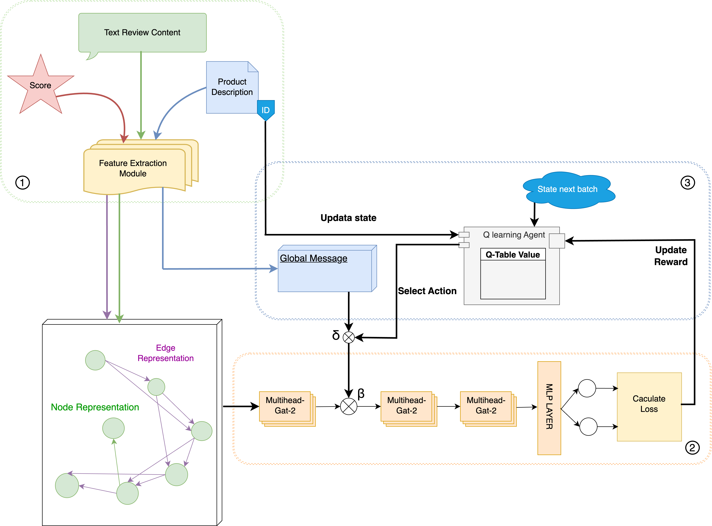

# shopee_spam_review_detection
Using GNN + RL for classical downstream task
1. Conducting crawling, collecting the user reviews, ratings and product descriptions 
2. Utilize unsupervised learning algorithms (k-mean, PCA) to identify rules, and analysis the user behavior
3. Develop deep learning pipeline using GNN + RL for downstream tasks

